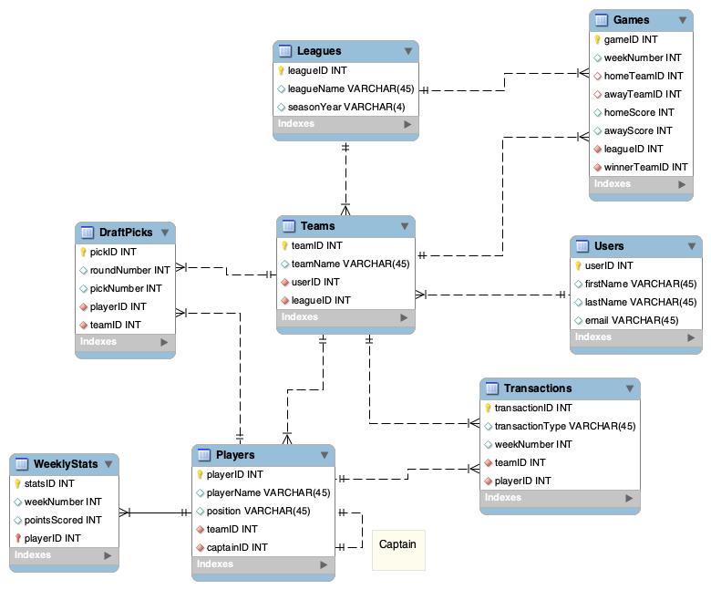

# 🏈 Fantasy Football League Database

## Team Name: Group [Your Group Number]

### Team Members
| Name | GitHub |
|------|--------|
| Elher Zemihret | [Link to GitHub] |
| Allison Davis | [Link to GitHub] |
| Coen Cardelli | [Link to GitHub] |
| Charlotte Holzapfel | [Link to GitHub] |

---

## Scenario Description

Our database models a **Fantasy Football League** platform — a system where users join leagues, manage teams, draft real NFL players, and compete based on those players' weekly real-life performance.

Each **League** hosts multiple **Users**, and each User manages one or more **Teams**. Teams are built through a **Draft**, where players (real NFL athletes) are selected in rounds. Once the season begins, **WeeklyStats** track each player's points scored per week, which determines how teams perform in head-to-head **Games**. Users can also make **Transactions** (adding, dropping, or trading players) throughout the season.

The database supports tracking of league activity, draft history, player performance, team standings, and transaction records — everything a league manager would need to run and analyze a fantasy football season.

---

## Data Model



> **Note:** Replace `data_model.png` with your actual ER diagram image uploaded to this repo.

### Explanation of the Data Model

**League** sits at the top of the hierarchy. A league has many **Teams**, but each Team belongs to exactly one League *(1:M)*. A league is identified by a unique `leagueID` and stores the season year.

**User** represents any person participating in the platform. A single User can manage multiple Teams across different leagues *(1:M)*. Users are identified by `userID` and store basic contact info (name, email).

**Team** is the central entity — it connects a User to a League. Each Team participates in many **Games**, initiates many **Transactions**, and makes many **DraftPicks** *(all 1:M)*.

**Player** represents a real NFL athlete. A Player can appear in many **WeeklyStats** records (one per week), many **DraftPicks** (across different leagues/seasons), and many **Transactions** *(all 1:M)*.

**WeeklyStats** captures a Player's fantasy points for a specific week. Each record is tied to one Player and one week number, and stores `pointsScored`.

**DraftPick** records which Team selected which Player, in what round and pick number. It links Team and Player *(M:1 to each)*.

**Game** records a head-to-head matchup between two Teams for a given week, storing the score for each side and the winner.

**Transaction** logs adds, drops, or trades. Each transaction is tied to a Team and a Player, along with the type and the week it occurred.

#### What the database supports:
- Tracking users, teams, leagues, and seasons
- Recording full draft history
- Storing player performance data week by week
- Logging game results and standings
- Managing roster transactions (adds, drops, trades)

#### What the database does NOT support:
- Real-time data feeds or live scoring
- Multiple positions per player per week
- Salary cap or auction draft formats
- Playoff bracket structures (beyond regular season games)

---

## Data Dictionary

### League
| Column | Data Type | Key | Description |
|--------|-----------|-----|-------------|
| leagueID | INT | PK | Unique identifier for each league |
| leagueName | VARCHAR(100) | | Name of the fantasy league |
| seasonYear | INT | | The NFL season year (e.g., 2024) |

### User
| Column | Data Type | Key | Description |
|--------|-----------|-----|-------------|
| userID | INT | PK | Unique identifier for each user |
| firstName | VARCHAR(50) | | User's first name |
| lastName | VARCHAR(50) | | User's last name |
| email | VARCHAR(100) | | User's email address |

### Team
| Column | Data Type | Key | Description |
|--------|-----------|-----|-------------|
| teamID | INT | PK | Unique identifier for each team |
| teamName | VARCHAR(100) | | Name of the fantasy team |
| userID | INT | FK (User) | The user who owns this team |
| leagueID | INT | FK (League) | The league this team belongs to |

### Player
| Column | Data Type | Key | Description |
|--------|-----------|-----|-------------|
| playerID | INT | PK | Unique identifier for each player |
| playerName | VARCHAR(100) | | Full name of the NFL player |
| position | VARCHAR(10) | | Player's position (QB, RB, WR, TE, K, DEF) |
| nflTeam | VARCHAR(50) | | Real NFL team the player plays for |

### WeeklyStats
| Column | Data Type | Key | Description |
|--------|-----------|-----|-------------|
| statsID | INT | PK | Unique identifier for each stats record |
| weekNumber | INT | | NFL week number (1–18) |
| pointsScored | DECIMAL(5,2) | | Fantasy points scored that week |
| playerID | INT | FK (Player) | The player these stats belong to |

### DraftPick
| Column | Data Type | Key | Description |
|--------|-----------|-----|-------------|
| pickID | INT | PK | Unique identifier for each draft pick |
| roundNumber | INT | | The draft round (e.g., 1–15) |
| pickNumber | INT | | The overall pick number |
| teamID | INT | FK (Team) | The team that made this pick |
| playerID | INT | FK (Player) | The player who was drafted |

### Game
| Column | Data Type | Key | Description |
|--------|-----------|-----|-------------|
| gameID | INT | PK | Unique identifier for each game |
| weekNumber | INT | | The week the game was played |
| homeTeamID | INT | FK (Team) | The home/first team |
| awayTeamID | INT | FK (Team) | The away/second team |
| homeScore | DECIMAL(6,2) | | Fantasy points scored by home team |
| awayScore | DECIMAL(6,2) | | Fantasy points scored by away team |
| winnerTeamID | INT | FK (Team) | The team that won the game |
| leagueID | INT | FK (League) | The league this game belongs to |

### Transaction
| Column | Data Type | Key | Description |
|--------|-----------|-----|-------------|
| transactionID | INT | PK | Unique identifier for each transaction |
| transactionType | VARCHAR(20) | | Type: ADD, DROP, or TRADE |
| weekNumber | INT | | The week the transaction occurred |
| teamID | INT | FK (Team) | The team making the transaction |
| playerID | INT | FK (Player) | The player involved in the transaction |

---

## Ten Queries

### Query Feature Matrix

| Feature | Q1 | Q2 | Q3 | Q4 | Q5 | Q6 | Q7 | Q8 | Q9 | Q10 |
|---------|----|----|----|----|----|----|----|----|----|----|
| Multiple Table Join | X | X | X | | X | X | X | | X | X |
| Subquery | | | X | | | X | | | X | |
| Correlated Subquery | | | | | | | | | | X |
| GROUP BY | X | X | X | X | | X | X | X | X | |
| GROUP BY with HAVING | | X | | | | | X | | | |
| Multi-condition WHERE | | | | X | X | | | X | | X |
| Built-in Functions / Calculated Field | X | X | X | X | | X | X | X | X | X |
| REGEXP | | | | | | | | X | | |
| NOT EXISTS | | | | | X | | | | | |

---

### Q1 — Top 5 Players by Average Weekly Points

**Description:** Retrieve the top 5 NFL players ranked by their average fantasy points scored per week.

**Managerial Justification:** League managers and users want to know which players are the most consistently valuable. This query helps identify which players to target in trades or on the waiver wire.

```sql
DELIMITER //
CREATE PROCEDURE TP_Q1()
BEGIN
    SELECT p.playerName, p.position, p.nflTeam,
           AVG(ws.pointsScored) AS avgPoints
    FROM Player p
    JOIN WeeklyStats ws ON p.playerID = ws.playerID
    GROUP BY p.playerID, p.playerName, p.position, p.nflTeam
    ORDER BY avgPoints DESC
    LIMIT 5;
END //
DELIMITER ;
```

**Result:** *(paste query output here)*

---

### Q2 — Teams with More Than 3 Transactions in a Season

**Description:** Find all fantasy teams that have made more than 3 transactions (adds, drops, or trades) within a league.

**Managerial Justification:** Highly active teams may signal engaged users or desperate roster management. Commissioners can use this to monitor trade activity and flag potential abuse.

```sql
DELIMITER //
CREATE PROCEDURE TP_Q2()
BEGIN
    SELECT t.teamName, u.firstName, u.lastName, COUNT(tr.transactionID) AS totalTransactions
    FROM Team t
    JOIN User u ON t.userID = u.userID
    JOIN Transaction tr ON t.teamID = tr.teamID
    GROUP BY t.teamID, t.teamName, u.firstName, u.lastName
    HAVING COUNT(tr.transactionID) > 3
    ORDER BY totalTransactions DESC;
END //
DELIMITER ;
```

**Result:** *(paste query output here)*

---

### Q3 — Players Drafted Who Scored Below League Average

**Description:** Identify drafted players whose average weekly points fall below the overall league average for all players.

**Managerial Justification:** Helps managers evaluate draft efficiency — if a team consistently drafts underperforming players, it signals poor draft strategy and could explain losing records.

```sql
DELIMITER //
CREATE PROCEDURE TP_Q3()
BEGIN
    SELECT p.playerName, p.position, t.teamName,
           AVG(ws.pointsScored) AS avgPoints
    FROM DraftPick dp
    JOIN Player p ON dp.playerID = p.playerID
    JOIN Team t ON dp.teamID = t.teamID
    JOIN WeeklyStats ws ON p.playerID = ws.playerID
    GROUP BY p.playerID, p.playerName, p.position, t.teamName
    HAVING AVG(ws.pointsScored) < (
        SELECT AVG(pointsScored) FROM WeeklyStats
    )
    ORDER BY avgPoints ASC;
END //
DELIMITER ;
```

**Result:** *(paste query output here)*

---

### Q4 — Weekly Points Scored by Each Team for a Specific Week

**Description:** Show the total fantasy points scored by each team during a given week (e.g., Week 5).

**Managerial Justification:** This is the core metric for determining weekly game outcomes. Managers use this data to compare performance and adjust rosters heading into the next week.

```sql
DELIMITER //
CREATE PROCEDURE TP_Q4()
BEGIN
    SELECT t.teamName, SUM(ws.pointsScored) AS totalPoints
    FROM Team t
    JOIN DraftPick dp ON t.teamID = dp.teamID
    JOIN WeeklyStats ws ON dp.playerID = ws.playerID
    WHERE ws.weekNumber = 5
    AND ws.pointsScored > 0
    GROUP BY t.teamID, t.teamName
    ORDER BY totalPoints DESC;
END //
DELIMITER ;
```

**Result:** *(paste query output here)*

---

### Q5 — Teams That Have Never Made a Transaction

**Description:** Find all teams that have not made any adds, drops, or trades during the season.

**Managerial Justification:** Inactive teams hurt league competitiveness. Commissioners can use this to identify disengaged users and reach out to improve participation.

```sql
DELIMITER //
CREATE PROCEDURE TP_Q5()
BEGIN
    SELECT t.teamName, u.firstName, u.lastName, u.email
    FROM Team t
    JOIN User u ON t.userID = u.userID
    WHERE NOT EXISTS (
        SELECT 1 FROM Transaction tr WHERE tr.teamID = t.teamID
    );
END //
DELIMITER ;
```

**Result:** *(paste query output here)*

---

### Q6 — League Standings Based on Win/Loss Record

**Description:** Calculate each team's wins and losses across all games within a league and sort by wins descending.

**Managerial Justification:** Standings are the primary measure of success in a fantasy league. This query powers leaderboards and determines playoff seeding.

```sql
DELIMITER //
CREATE PROCEDURE TP_Q6()
BEGIN
    SELECT t.teamName,
           COUNT(CASE WHEN g.winnerTeamID = t.teamID THEN 1 END) AS wins,
           COUNT(CASE WHEN g.winnerTeamID != t.teamID 
                      AND (g.homeTeamID = t.teamID OR g.awayTeamID = t.teamID) THEN 1 END) AS losses
    FROM Team t
    JOIN Game g ON t.teamID = g.homeTeamID OR t.teamID = g.awayTeamID
    WHERE t.leagueID = (SELECT leagueID FROM League LIMIT 1)
    GROUP BY t.teamID, t.teamName
    ORDER BY wins DESC;
END //
DELIMITER ;
```

**Result:** *(paste query output here)*

---

### Q7 — Draft Round Efficiency: Average Points by Round

**Description:** Calculate the average fantasy points scored by players grouped by the draft round in which they were selected.

**Managerial Justification:** Reveals whether early round picks justify their draft position. If late-round picks outperform early ones, it signals poor draft strategy across the league — valuable insight for future drafts.

```sql
DELIMITER //
CREATE PROCEDURE TP_Q7()
BEGIN
    SELECT dp.roundNumber,
           COUNT(DISTINCT dp.playerID) AS playersDrafted,
           AVG(ws.pointsScored) AS avgPointsPerRound
    FROM DraftPick dp
    JOIN WeeklyStats ws ON dp.playerID = ws.playerID
    GROUP BY dp.roundNumber
    HAVING AVG(ws.pointsScored) > 5
    ORDER BY dp.roundNumber ASC;
END //
DELIMITER ;
```

**Result:** *(paste query output here)*

---

### Q8 — Find Players at Skill Positions (QB, RB, WR, TE) Using REGEXP

**Description:** Retrieve all players whose position matches one of the four primary skill positions using a regular expression pattern.

**Managerial Justification:** Fantasy leagues often score skill positions differently. Filtering by position group lets managers compare position scarcity and depth across the league.

```sql
DELIMITER //
CREATE PROCEDURE TP_Q8()
BEGIN
    SELECT playerName, position, nflTeam,
           AVG(ws.pointsScored) AS avgPoints
    FROM Player p
    JOIN WeeklyStats ws ON p.playerID = ws.playerID
    WHERE p.position REGEXP '^(QB|RB|WR|TE)$'
    AND ws.pointsScored > 0
    GROUP BY p.playerID, p.playerName, p.position, p.nflTeam
    ORDER BY position, avgPoints DESC;
END //
DELIMITER ;
```

**Result:** *(paste query output here)*

---

### Q9 — Users Who Manage Teams in Multiple Leagues

**Description:** Find users who are participating in more than one fantasy league simultaneously.

**Managerial Justification:** Power users who manage multiple teams are highly engaged. Identifying them helps platform administrators target premium feature offerings or provide support.

```sql
DELIMITER //
CREATE PROCEDURE TP_Q9()
BEGIN
    SELECT u.userID, u.firstName, u.lastName, u.email,
           COUNT(t.teamID) AS numberOfTeams
    FROM User u
    JOIN Team t ON u.userID = t.userID
    GROUP BY u.userID, u.firstName, u.lastName, u.email
    HAVING COUNT(t.teamID) > 1
    ORDER BY numberOfTeams DESC;
END //
DELIMITER ;
```

**Result:** *(paste query output here)*

---

### Q10 — Players Outperforming Their Own Season Average in the Latest Week

**Description:** Use a correlated subquery to find players whose most recent week's score exceeds their own personal season average.

**Managerial Justification:** Hot players — those trending above their own baseline — are prime trade targets and waiver wire pickups. This query surfaces players with current upward momentum.

```sql
DELIMITER //
CREATE PROCEDURE TP_Q10()
BEGIN
    SELECT p.playerName, p.position, p.nflTeam,
           ws.weekNumber, ws.pointsScored AS latestWeekPoints
    FROM Player p
    JOIN WeeklyStats ws ON p.playerID = ws.playerID
    WHERE ws.weekNumber = (SELECT MAX(weekNumber) FROM WeeklyStats)
    AND ws.pointsScored > (
        SELECT AVG(ws2.pointsScored)
        FROM WeeklyStats ws2
        WHERE ws2.playerID = p.playerID
    )
    ORDER BY ws.pointsScored DESC;
END //
DELIMITER ;
```

**Result:** *(paste query output here)*

---

## Database Information

- **Database Name:** `fantasy_football_db`
- **Platform:** MySQL
- **All queries are bookmarked as stored procedures** named `TP_Q1` through `TP_Q10`

---

## Additional Notes

- Each table is populated with at least 10+ rows of sample data to ensure queries return meaningful result sets
- Foreign key constraints are enforced to maintain referential integrity
- The data model was designed to be scalable across multiple seasons by including `seasonYear` in the League table
